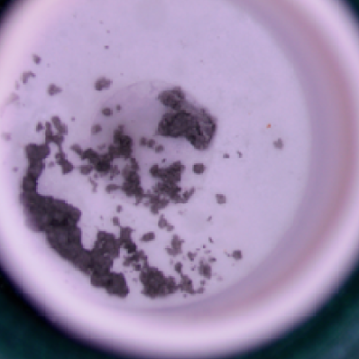
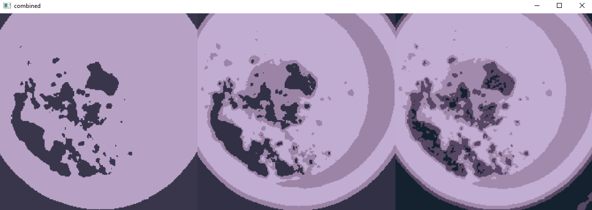

# color-segment
This code will segment the image into 'k' number of clusters of the most dominant colors. Look at image below.  

<pre>
original 
  

         K=2                      K=3                        K=4 

</pre>

With some clever logic and modification, it may be possible to only isolate the pixels on the image that are powder.
